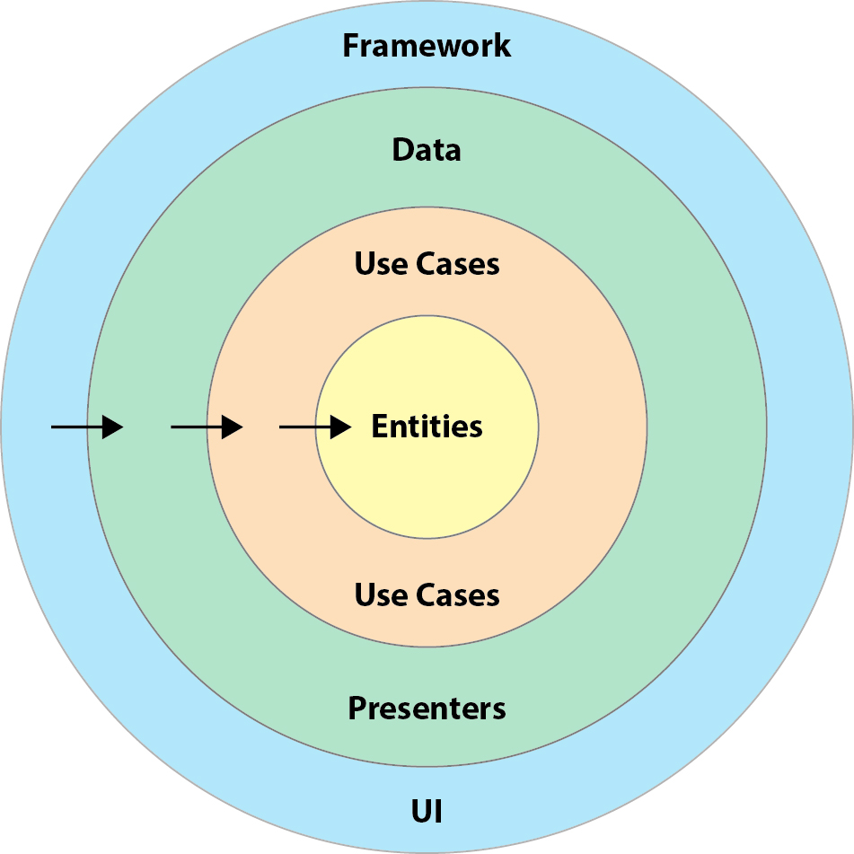

# AGENTS

Project-specific guidance for automated changes in this repository.

## General

- Prefer `rg` for search and `apply_patch` for small edits.
- Keep edits ASCII unless a file already uses Unicode.
- Avoid destructive git commands unless explicitly asked.
- If something is unclear, search the repo first (code, tests, docs). If still unclear, ask.

## Git workflow (branching, commits, cleanliness)

- Before starting any task, ensure the working tree is clean (no uncommitted changes).
    - Use `git status` (or `git status --porcelain`) to verify cleanliness.
    - If there are changes, STOP and ask how to proceed.

### Branching rules

- Base branches:
    - New features MUST branch from an updated `master`:
        - `feature/<name>`
    - Issues MUST branch from the current updated feature branch:
        - `issue/<issue-title-normalized>`

### PR & merge rules (strict)

- Never merge any branch directly into `master` locally.
- Do not mix branches into `master`.
- Do not open PRs targeting `master`.
    - PRs MUST target the current feature branch.
- Only inform when the PR is ready for review.

### Commit rules

- Prefer small commits grouped by task.
- Do not amend/rewrite history unless explicitly asked.

## Repo Layout

- Modules use a Clean Architecture split: `domain`, `data`, and `ui`.
- Features live under `feature/{auth,media,core}` with modules like `auth_domain`, `auth_data`,
  `auth_ui`.
- Shared test utilities live in `test_shared`.
- Some `data` modules expose shared test helpers via `testFixtures`.
- Gradle convention plugins live in `build-logic/convention`.

## Build & Configuration

- Build files are named after their module (e.g., `feature/auth/auth_ui/auth_ui.gradle.kts`) via
  `setProjectBuildFileName` in `settings.gradle.kts`.
- Dependencies and plugin aliases are centralized in `gradle/libs.versions.toml`.
- Convention plugins used across modules:
    - `tmdb.android.application`
    - `tmdb.ui.module.plugin`
    - `tmdb.framework.module.plugin`
    - `tmdb.room.module.plugin`
    - `tmdb.kotlin.module.plugin`
    - `tmdb.test.shared.plugin`
- Sensitive config goes in `local.properties` (e.g., `TMDB_API_KEY`, signing fields). Never commit
  secrets.

## Dependencies (strict rules)

- No new dependencies without explicit approval.
- All dependencies MUST be added via `gradle/libs.versions.toml`.
- Prefer existing libraries already used in the repo.
- If a new approved dependency applies broadly:
    - If it should be used by all modules or by a module type (e.g., all `*_data` modules),
      add it to the appropriate Gradle convention plugin instead of repeating it across modules.
    - If unsure whether it belongs in a convention plugin, STOP and ask.
- If an approved dependency is needed only in a single module, it MAY be added directly to that
  module
  (e.g., `implementation(libs.roomPaging)` in `media_data` only).

## Architecture & DI

- Domain modules define contracts only (interfaces, models); implementations live in `data` modules.
- Use cases in `<feature>_domain` are contracts (interfaces) implemented by repositories in
  `<feature>_data`.
- UI is Jetpack Compose; ViewModels are wired with Koin (`koinViewModel`), and DI modules live in
  `di/` packages.
- Dependency rule: `ui` -> `domain` <- `data` (no `ui` -> `data` or `domain` -> anything).
- Keep DI wiring consistent with existing patterns in the repo. Do not introduce a new DI approach.

## Koin DI conventions

- Koin is the only DI framework used in this repo. Do not introduce Hilt/Dagger or other DI.
- DI modules MUST live in `di/` packages inside each module
  (e.g., `feature/<name>/<name>_data/di`, `feature/<name>/<name>_ui/di`).
- Prefer module-level DI wiring:
    - `<feature>_data` provides data implementations (APIs, DAOs, repositories).
    - `<feature>_domain` exposes contracts/use cases (no implementations).
    - `<feature>_ui` provides ViewModels and UI wiring.
- ViewModels MUST be resolved via Koin and used from Compose via `koinViewModel()` (follow existing
  repo patterns).
- Do not use global singletons or service locators (`object` instances) to replace DI.

### Binding rules

- Use `single` for shared components (Retrofit, Database, DAOs, repositories).
- Use `factory` for lightweight/stateless objects (builders, small helpers).
- If parameters are required, use Koin parameter injection (`parametersOf(...)`) (follow existing
  patterns).

### Qualifiers & primitives (type-safe wrappers)

- Do NOT use `named()`, `StringQualifier`, or string-based qualifiers.
- Primitive values (String, Boolean, Int, etc.) that are shared (e.g., API keys, base URLs)
  MUST be wrapped in explicit types (`@JvmInline value class` preferred).
- Inject wrapped types directly via Koin (type-safe). This pattern replaces Koin qualifiers.
- Do not inject raw `String` configuration values.

### Safety

- Do not create multiple competing definitions for the same type without an explicit need.
- If a definition becomes unreachable or ambiguous, stop and fix DI graph before proceeding.

## Architecture Reference

## Implementation Patterns (Canonical)

### Module responsibilities

- `feature/<name>/<name>_domain`:
    - Domain entities live in `entities/`
    - Use cases live in `usecases/`
    - Contracts only: interfaces + domain models. No Retrofit/Room/Android types.
- `feature/<name>/<name>_data`:
    - Framework edge code lives in `framework/` (Retrofit/Room/etc.)
    - Repositories live in `repositories/` and orchestrate remote/local + mapping to domain
    - DI wiring lives in `di/`
    - Shared helpers live in `utils/`
- `feature/<name>/<name>_ui`:
    - DI wiring lives in `di/`
    - Navigation routes/graphs live in `navigation/`
    - Presentation logic (MVVM ViewModels) lives in `presenter/<screen>/`
    - Compose UI lives in `view/<screen>/`

### Framework layer (inside `<name>_data/framework`)

- Remote:
    - Retrofit interfaces use `*Api` naming (e.g., `AuthenticationApi`)
    - Remote DTOs use `Remote*` naming
- Local (Room):
    - DAOs use `*Dao` naming (e.g., `SessionDao`, `AccountDao`)
    - Entities use `Room*` naming (e.g., `RoomSession`, `RoomUserAccount`)

### Mapping conventions

- Mapping functions are repository implementation details and MUST be kept `private` inside
  repositories.
- Mappers are simple 1:1 field mapping (+ nullability checks). Avoid adding business logic in
  mapping.
- Prefer explicit mapping extensions with consistent names (even when `private`):
    - `RemoteX.toLocalStorage(): RoomX`
    - `RoomX.toDomain(): X`
- Do not write direct tests for mappers. Compiler + higher-level tests are sufficient.
- Repositories must not leak `Remote*` or `Room*` types outside `<name>_data`.

### Repository collaboration rules (allowed)

- A repository MAY depend on another repository if it preserves separation of concerns
  (e.g., session/account responsibilities remain split but coordinated).
- A repository MAY implement multiple use cases when it is the natural owner of that behavior.
- Do not merge unrelated concerns just to reduce class count.

### UI layering rules (MVVM)

- `presenter/` is the Presentation layer and uses MVVM:
    - ViewModels live under `presenter/<screen>/`
    - ViewModels own UI state, event handling, and call domain use cases
- `view/` contains Compose UI only:
    - render state
    - forward UI events to the ViewModel
    - no business logic, no data access, no use case orchestration in Composables
- `navigation/` defines routes and wiring between screens.
- UI MUST depend only on `<name>_domain` (never on `<name>_data`).

### Prohibited patterns

- Do not reference `Retrofit`, `@GET/@POST`, `RoomDatabase`, `@Dao`, `@Entity` outside
  `<name>_data`.
- Do not reference `Remote*` or `Room*` types outside `<name>_data`.
- Do not create direct data access from UI (no DAOs/APIs in UI).
- No repositories/DAOs/APIs in `view/` or `navigation/`.
- No calling use cases directly from Composables (must go through ViewModel).

## Testing Expectations (Mandatory)

- Follow TDD for any behavior change:
    1) Write/adjust a failing test first (red)
    2) Make the minimal change to pass (green)
    3) Refactor only after green
- Prefer fast unit tests at `domain`/`data` boundaries. Use UI/instrumented tests only when
  necessary.
- When fixing bugs, add a regression test that fails before the fix and passes after.
- Do not disable or delete tests to make builds pass. If a test is flaky, report it and propose a
  fix.

## Definition of Done

A change is considered done only if:

- The code compiles and tests pass for affected modules.
- Architecture rules are preserved (`ui` does not depend on `data`; domain has no implementations).
- No new dependency is added without explicit approval.
- Public APIs (interfaces/models) are not changed unless required by the Spec/Task.

## Verification

- Always run the smallest relevant Gradle task(s) that validate the change.
- Use Gradle tasks when needed, for example:
    - `./gradlew test`
    - `./gradlew :feature:auth:auth_ui:connectedDebugAndroidTest`
    - `./gradlew :app:connectedDebugAndroidTest`
- If a change impacts multiple modules, run module-level unit tests for each impacted module plus
  `./gradlew test`.

## Change Safety Rules

- Implement only what is required by the current Spec/Task.
- Avoid refactoring unrelated code. Prefer surgical changes.
- Keep APIs stable: avoid renaming public types/functions unless necessary.